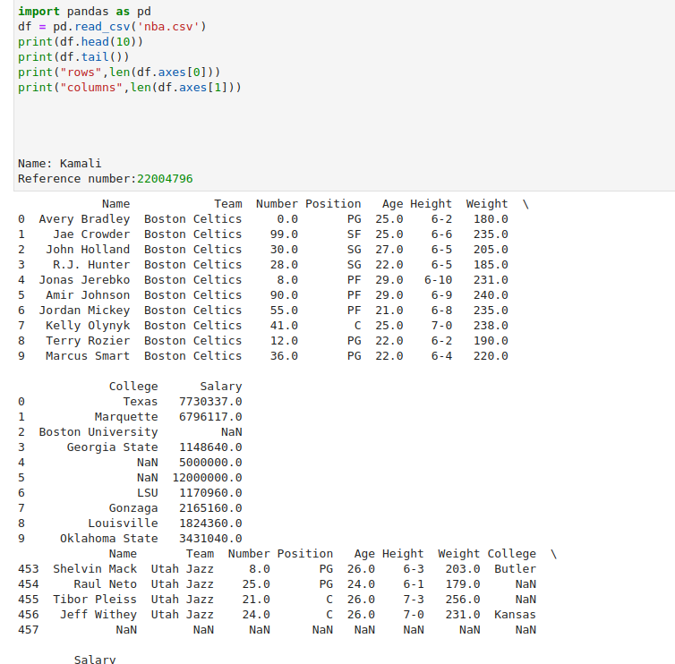

# Implementation of Multivariate Linear Regression
## Aim
To write a python program to implement multivariate linear regression and predict the output.
## Equipment’s required:
1.	Hardware – PCs
2.	Anaconda – Python 3.7 Installation / Moodle-Code Runner
## Algorithm:

```
Step1:import pandas as pd.

Step2:Read the csv file.

Step3:Get the value of X and y variables.

Step4:Create the linear regression model and fit.

Step5:Predict the CO2 emission of a car where the weight is 2300kg, and the volume is 1300cm cube.

Step6:Print the predicted output .
```


# Program
import pandas as pd
df = pd.read_csv('nba.csv')
print(df.head(10))
print(df.tail())
print("rows",len(df.axes[0]))
print("columns",len(df.axes[1]))


Name: Kamali
Reference number:22004796

## Output:



## Result
Thus the multivariate linear regression is implemented and predicted the output using python program.